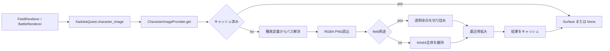

# キャラクター画像取得責務分離機能説明書

## 目的

種族JSONからの画像パス選択、PNG読込、フィールド画像の透明余白処理、ドットを崩さない拡大、メモリキャッシュを `CharacterImageProvider` へ集約する。ゲーム進行と描画処理から画像I/Oを分離する。

## 責務

| 対象 | 責務 |
|---|---|
| `CharacterImageProvider` | 用途・方向別パス解決、PNG読込、フィールド余白切詰め、縦横比維持、最近傍拡大、成功・失敗結果のキャッシュ |
| `GameRepository` | 種族JSONの読込と種族定義の提供 |
| `KadokaQuest` | 互換メソッドからプロバイダーへ取得要求を委譲 |
| `FieldRenderer / BattleRenderer` | 取得済みSurfaceの配置と描画。ファイルを直接読まない |

## 取得フロー

## 用途とパス

| `kind` | 読み込む定義 | 前処理 |
|---|---|---|
| `portrait` などfield以外 | `portrait_path` | キャンバス全体を維持 |
| `field` | `field_sprites.front`、なければ `field_sprite_path` | 透明余白を切り詰め |
| `field_front/right/left/back` | 対応する `field_sprites`、なければ `field_sprite_path` | 透明余白を切り詰め |

戦闘用の姿には元の64×64画像全体を使用する。フィールドでは透明キャンバスの余白によってキャラクターだけが極端に小さくならないよう、不透明度8以上の境界で切り詰める。

## ドット絵の拡大契約

指定された表示枠へ縦横比を維持して収める。`pygame.transform.scale` の最近傍サンプリングだけを使用し、`smoothscale` は使用しない。これにより64×64以下の元ドットへ中間色やぼかしを追加しない。

## キャッシュと失敗

キャッシュキーは `(species_id, kind, width, height)` である。同じ要求には同じSurfaceを返す。ファイル欠損、不正PNG、不正表示サイズも `None` としてキャッシュし、毎フレーム同じI/Oエラーを繰り返さない。エディターなどが画像を更新した場合に備えて `clear()` で全結果を破棄できる。

## 保存形式と互換性

元画像、アップスケール画像、種族JSONには変更を加えない。キャッシュは実行中メモリだけに存在する。既存の `KadokaQuest.character_image()` と `image_cache` は互換窓口として残す。
