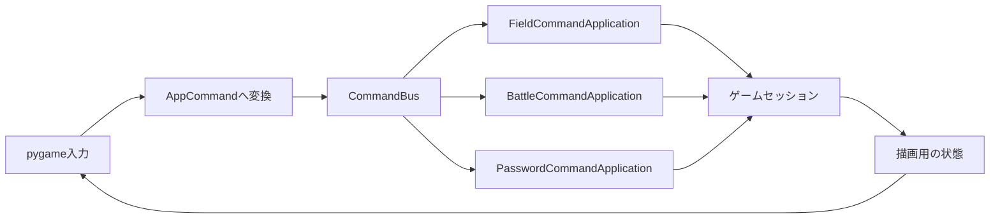

# コマンド駆動アプリ基盤機能説明書

## 目的

画面入力からゲーム処理を直接呼び出す結合をなくし、各アプリが意味のあるコマンドだけで動作する土台を作る。第1段階ではフィールド、戦闘、暗号入力を独立したコマンド対象にする。

## コマンド契約

| 要素 | 内容 | 例 |
|---|---|---|
| `target` | 配送先アプリ | `field` |
| `action` | アプリ内の操作名 | `move.start` |
| `payload` | 操作に必要なプレーンデータ | `{"direction": "left", "now": 1200}` |

コマンドバスは1つのtargetを1つのハンドラーへだけ配送する。対象の重複登録、不明なtarget、未対応actionはエラーにする。

## 現在の構成

pygame側はモードや状態を読み取って描画できるが、移動、決定、戦闘実行、暗号入力、定期更新は必ずコマンドを送る。

## 主なコマンド

| target | action | 用途 |
|---|---|---|
| `field` | `move.start / move.stop / tick` | 意味方向による移動と周期更新 |
| `field` | `interact / pickup` | 調査とフィールドスキル |
| `field` | `party.select / tactic.cycle / ai.reset` | パーティ個体操作 |
| `field` | `acquire.scan / simulation.start` | 外部個体の走査と模擬戦開始 |
| `battle` | `selection.move / selection.set` | コマンド選択 |
| `battle` | `execute / execute.selected` | 戦闘コマンド実行 |
| `battle` | `auto.toggle / tick / return` | オート、演出更新、帰還 |
| `password` | `append / backspace / submit / cancel` | 仮想キーボード操作 |

## 移植性

コマンドアプリはpygameをimportしない。payloadへpygameキーコードや描画オブジェクトを含めず、方向は `left / right / back / front` の文字列で渡す。この制約により、将来別プロセス、GDScript、Luaなどへ境界を移しても同じコマンド契約を使える。

## 継続する分割

第2段階で戦闘画面描画、戦闘計算、AI学習、AI推論、戦闘データ読込を独立責務へ分けた。ゲームセッションは互換窓口として残っているため、次はフィールド本体など残る巨大クラスをデータ・UI・処理へ分ける。開発予定の「ロジックの整理」は、その分割が終わるまで完了扱いにしない。
