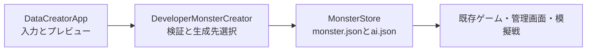

# データクリエイター機能説明書

## 目的

開発者が種族とレベルを指定し、ゲームがそのまま読み込めるモンスター個体フォルダを生成する。個体専用の中間形式やエクスポート処理は作らない。

## 入力

| 項目 | 内容 |
| --- | --- |
| 種族 | `data/species` に存在する種族IDから選択 |
| レベル | 1～100 |
| 個体名 | 空欄の場合は種族の表示名 |
| 個体ID | 空欄の場合は自動生成。指定時は半角小文字・数字・`_`・`-` |
| 生成先 | 現在のセーブ、獲得用、模擬戦用 |

画面には指定レベル時点の6能力と習得スキルを表示する。

## 生成先

| 選択肢 | 保存場所 | 用途 |
| --- | --- | --- |
| 現在のセーブへ直接追加 | `savedata/<active>/monsters/<individual_id>/` | 直ちに保有個体として使用 |
| 獲得用 | `imports/acquire/<individual_id>/` | ゲーム内の個体再走査で獲得 |
| 模擬戦用 | `imports/simulation/<individual_id>/` | コピーせず模擬戦に参加 |

## 処理の分離

画面処理は `apps/data_creator.py`、生成処理は `data/developer_monster_creator.py`、個体フォルダの書き込みは既存の `MonsterStore` が担当する。将来ほかの画面系へ移行しても生成処理とJSON形式を再利用できる。

## 安全性

- レベル範囲外、未知の生成先、不正な個体IDを拒否する。
- 同じ生成先に同一個体IDが存在する場合は上書きしない。
- 出力先を明示してから生成し、通常セーブと開発用インポートを混同しない。
