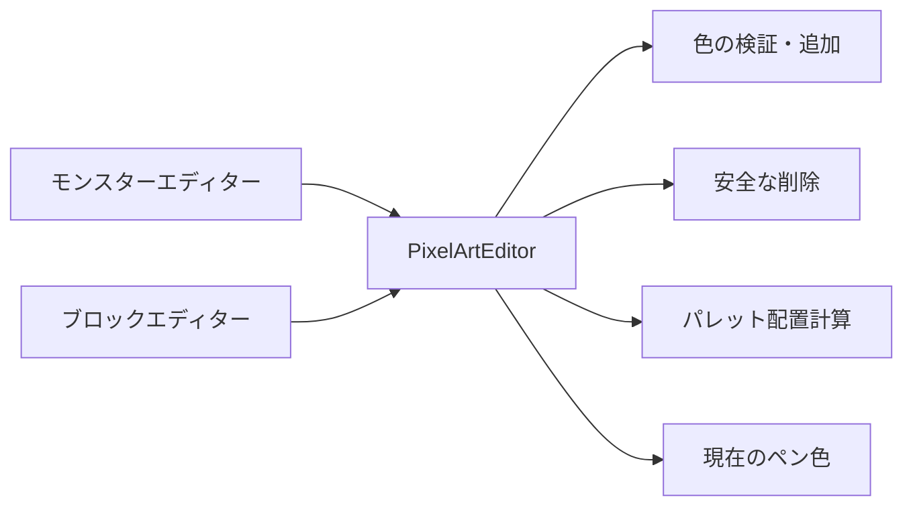

# ドットエディターパレット機能説明書

## 目的

モンスターとブロックの見た目編集で、作業中に必要なペン色を追加・削除できるようにする。画像編集処理は `PixelArtEditor` に集約し、各画面は入力欄とボタンの配置だけを担当する。

## 操作と制約

| 操作 | 結果 |
|---|---|
| `#RRGGBB` を入力して「色を追加」 | 色を末尾へ追加し、ペン色として選択する |
| 登録済みの色を追加 | 重複させず、その色を選択する |
| 「選択色を削除」 | 現在の不透明色をパレットから削除する |
| 透明色を削除 | 拒否する |
| 最後の不透明色を削除 | 描画不能を防ぐため拒否する |
| 17色目を追加 | 上限エラーを表示する |

パレットは透明色を含めて最大16色とする。入力時には英字の大小を区別せず、画面には大文字の `#RRGGBB` で表示する。

## 処理の共有

両エディターは同じ `add_palette_color`、`remove_palette_color`、`palette_rects` を使う。画面ごとの差はパレットの起点、列数、色見本サイズだけである。

## 保存形式

パレットはアプリ起動中の編集セッションだけに存在し、JSONやPNGメタデータへは保存しない。完成画像は従来どおりRGBA PNGとして保存されるため、MOD形式やゲーム本体の読み込み処理は変わらない。
