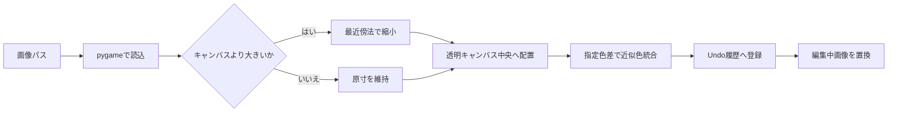

# ドットエディター画像編集機能説明書

## 目的

モンスターとブロックの共通ドットエディターへ、一般的な画像編集の基本操作を追加する。画面は入力と結果表示だけを担当し、ピクセル変換は `pixel_operations.py` に集約する。

## 機能

| 機能 | 入力 | 処理 | Undo |
|---|---|---|---|
| 塗りつぶし | キャンバス上の左／右クリック | 上下左右でつながる完全同色領域だけをペン色／透明色へ置換 | 1回 |
| 画像読込 | 画像パス、色差0～255 | 最近傍縮小、中央配置、近似色統合 | 1回 |
| 色統合 | 色差0～255 | 同じアルファ値を持つ近いRGB色を代表色へ統合 | 変更時1回 |

右クリックの塗りつぶしは領域を透明化する。透明色は近似色統合の対象外とし、半透明色はアルファ値が同じ色同士だけを統合する。

## 画像読込

縦横比は常に維持する。64×64より小さい画像を拡大しないため、意図しない輪郭の変形や粗い拡大を避けられる。

## 色差

色差は0～255の整数で、RGB各成分の差からユークリッド距離を求める。0では完全同色だけ、値を大きくするほど広い範囲の色が統合される。既定値は24とする。統合先は画像を上から走査したときに先に現れた近い色である。

## 保存形式

追加のJSONデータはない。編集結果は既存と同じRGBA PNGへ保存し、パレットや色差、元画像パスは保存データへ埋め込まない。
