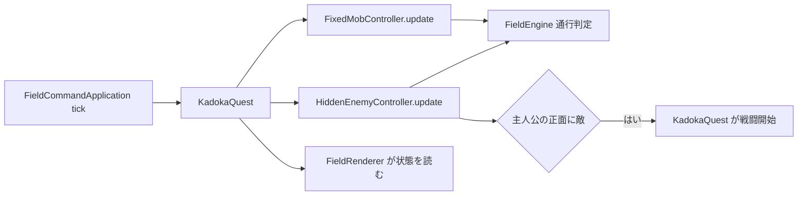

# フィールドアクター責務分離機能説明書

## 目的

フィールド上のキャラクター状態と移動規則を `KadokaQuest` から切り離し、描画、保存、pygame入力に依存しない状態機械として単独テストできるようにする。第3段階では固定モブと、画面に表示しない野生敵を対象にする。

## 責務

| クラス | 持つ状態 | 判断すること | 判断しないこと |
|---|---|---|---|
| `FixedMobController` | 現在マップの固定モブ一覧 | 初期配置、重複回避、会話デッキ、正面停止、AI移動、移動周期 | 描画、JSON保存、戦闘開始 |
| `HiddenEnemyController` | 現在マップの非表示敵一覧 | ボールスライム除外、出現配置、視線、追跡/徘徊、占有、移動周期 | 描画、個体生成、戦闘開始 |
| `FieldEngine` | 現在のマップとブロック参照 | 通行、イベント位置、正面座標、直線視認 | アクター一覧の所有、時間管理 |
| `KadokaQuest` | ゲーム全体の互換窓口 | 保存、モード変更、遭遇から戦闘への接続 | 固定モブや非表示敵の移動候補計算 |

## 呼び出しの流れ

## 互換性

既存コードが参照する `home_npcs` と `hidden_monsters` はプロパティとして残し、各コントローラーの一覧を返す。`reset_home_npcs`、`move_home_npc`、`monster_sees_player`、`update_field_mobs` なども薄い委譲メソッドとして維持する。このため、既存テスト、描画、MOD向けJSON形式は変更しない。

## 移植境界

両コントローラーはpygameと `kadoka_quest.data` をimportしない。時刻は整数ミリ秒、座標は整数タプル、マップ・ブロック・アクターは辞書とリストで受け渡す。描画用の `GridMovement` もpygame非依存であり、固定モブの論理座標と表示補間を分離したまま利用する。

## 継続項目

主人公の長押し移動、イベント解釈、フィールド進行保存、マップ読込は第4段階で分離した。戦闘開始・暗号入力・管理画面など別アプリへ渡す効果の最終接続は、互換窓口として `KadokaQuest` に残る。
