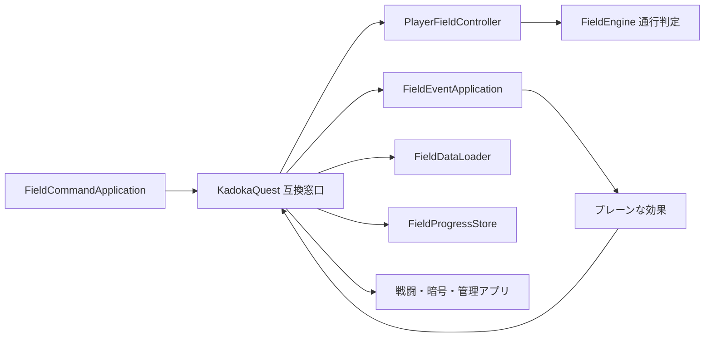

# フィールドセッション責務分離機能説明書

## 目的

`KadokaQuest` に残っていた主人公移動、イベント判断、フィールド進行保存、マップ読込を、それぞれ独立した状態機械またはデータ責務へ分ける。pygame入力と描画を差し替えても、整数マス座標と既存JSONを同じ契約で利用できる構成にする。

## 責務

| クラス | 責務 | 主な状態・出力 |
|---|---|---|
| `PlayerFieldController` | 主人公のフィールド移動状態機械 | 整数座標、向き、長押し方向、次回入力時刻、表示補間 |
| `FieldEventApplication` | NPCまたはイベントを1つのアプリ効果へ変換 | `message / transition / npc_battle / register_church` などのプレーン辞書 |
| `FieldProgressStore` | フィールド進行だけを永続化 | 現在地、復活地点、拾得品、フラグ、消滅固定モブ |
| `FieldDataLoader` | フィールド用データ読込 | マップ、ブロック、範囲内へ補正した入口座標 |
| `KadokaQuest` | 異なるアプリ間の効果接続と互換窓口 | 戦闘開始、暗号画面、管理画面への切替 |

## 処理の流れ

## 主人公移動

`PlayerFieldController` は論理座標を常に整数で保持する。移動可能判定は `FieldEngine` に問い合わせ、成功時だけ座標と `GridMovement` の表示目標を更新する。長押しは方向名と整数ミリ秒で管理し、pygameキーコードを受け取らない。

## イベント効果

`FieldEventApplication` はイベントを直接描画・保存・戦闘実行せず、必ず1つの辞書効果へ変換する。これにより、教会登録やマップ移動などの判断と、JSON保存や別アプリ起動を分離する。

| 効果 | 接続先 |
|---|---|
| `transition` | `FieldDataLoader` で移動先を読み、現在地を保存 |
| `register_church` | `FieldProgressStore` |
| `npc_battle` | 戦闘アプリ |
| `open_password` | 暗号入力アプリ |
| `open_manager` | モンスター管理アプリ |
| `gain_item` | `FieldProgressStore` |

## 保存形式と互換性

新しいJSONファイルやキーは追加しない。`state.json` とマップJSONの形式は従来どおりである。`KadokaQuest.player_x / player_y / player_direction / player_movement / held_move_direction / next_move_tick` はプロパティとして残り、既存テストと描画コードは変更なしで新しい状態機械を参照する。

## 継続項目

`KadokaQuest` は戦闘セッション、暗号入力状態、管理プロセス、画像キャッシュなど複数画面を接続する状態をまだ持つ。次段階では、画面モードと別アプリへの遷移結果を専用の実行時オーケストレーターへ集約する。
