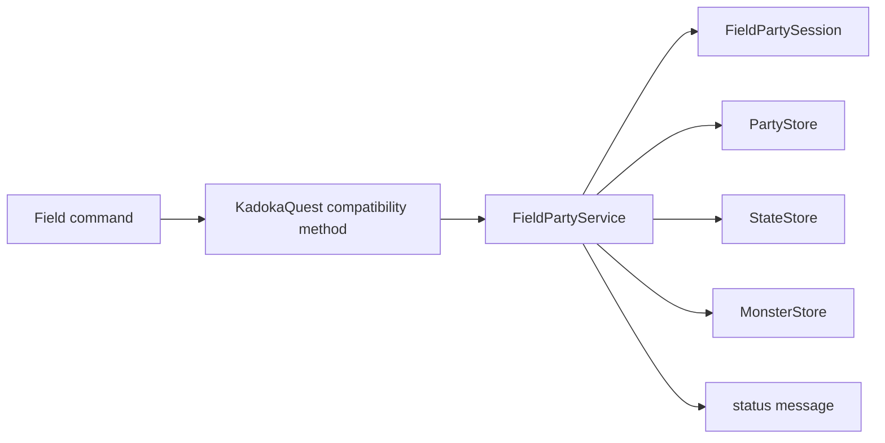

# フィールドパーティ永続操作責務分離機能説明書

## 目的

フィールド上の簡易パーティ操作に伴う保存層の調停を `game.py` から切り離す。`FieldPartyService` は既存の選択セッションとデータStoreを組み合わせ、結果を案内文としてゲーム進行へ返す。pygameや描画には依存しない。

## 責務

| 対象 | 責務 |
|---|---|
| `FieldPartyService` | プリセット保存・順次読込、選択個体の作戦変更・AIリセットの調停 |
| `FieldPartySession` | 選択中のパーティ枠とプリセット巡回位置 |
| `PartyStore` | 無制限のプリセットJSON保存・一覧・読込 |
| `StateStore` | 読み込んだ現在パーティの保存 |
| `MonsterStore` | 個体の作戦変更とAI初期化 |
| `KadokaQuest` | サービスへ現在状態を渡し、返された案内文を表示 |

## 処理フロー

## 操作契約

| 操作 | 入力 | 結果 |
|---|---|---|
| `select` | 0始まりの枠番号 | セッションの選択位置を更新 |
| `save_preset` | 現在のstate | 時刻付き名称で現在パーティを保存 |
| `load_next_preset` | 現在のstate | 次のプリセットを読み、存在する個体IDを現在パーティへ保存 |
| `cycle_tactic` | 現在パーティ | 選択個体の作戦を定義順で次へ変更 |
| `reset_selected_ai` | 現在パーティ | 選択個体のAIだけを初期化 |

パーティが空のとき作戦変更とAIリセットは何も行わない。プリセット一覧が空のときは巡回位置とstateを変更せず「保存パーティがありません。」を返す。

## 保存形式

サービスは新しいファイルやJSONキーを所有しない。プリセットは `savedata/<name>/parties/*.json`、現在パーティは `state.json.current_party`、個体AIは `monsters/<id>/ai.json` を使用する。欠損した個体IDを空き枠として扱う既存規則と、プリセット数に上限を設けない規則も維持する。
