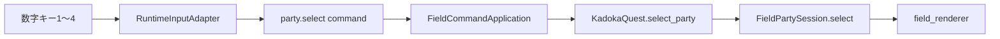
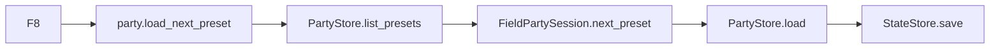

# フィールドパーティ選択状態責務分離機能説明書

## 目的

フィールドで素早く操作対象を選ぶカーソル状態を `game.py` から切り離す。`FieldPartySession` は選択中のパーティ枠と、次に読み込む保存プリセットの巡回位置だけを所有し、pygame、ファイルI/O、戦闘処理には依存しない。

## 責務

| 対象 | 責務 |
|---|---|
| `FieldPartySession` | 選択枠の範囲制限、現在人数への補正、プリセットの順次選択 |
| `FieldCommandApplication` | `party.select` の意味コマンドを公開操作へ配送 |
| `KadokaQuest` | 選択された個体に対する作戦変更・AIリセットと、保存層の呼び出し |
| `PartyStore / StateStore / MonsterStore` | プリセット、現在パーティ、個体AIの永続化 |
| `field_renderer` | 互換プロパティから選択位置を読み、選択枠を描画 |

## 呼び出しの流れ

プリセットの巡回は次のとおり。

## 選択規則

| 操作 | 規則 |
|---|---|
| 数字キー選択 | 0始まりの内部位置を0～3へ制限 |
| 作戦変更・AIリセット | 現在パーティが空なら何もしない。人数が減った場合は人数で循環補正 |
| 次プリセット | ファイル一覧を順番に選び、末尾の次は先頭へ戻る |
| プリセットなし | 巡回位置を進めず、従来の案内を表示 |

## 互換性と保存形式

`KadokaQuest.selected_party` と `KadokaQuest.preset_index` は既存テスト、描画、拡張コード向けの互換プロパティとして残す。値の本体は `FieldPartySession` にある。

両方とも実行時のUIカーソルであり保存しない。パーティ本体は `state.json.current_party` と `parties/*.json`、AI本体は個体フォルダの `ai.json` を従来どおり使用するため、MOD・セーブデータ形式の変更はない。
