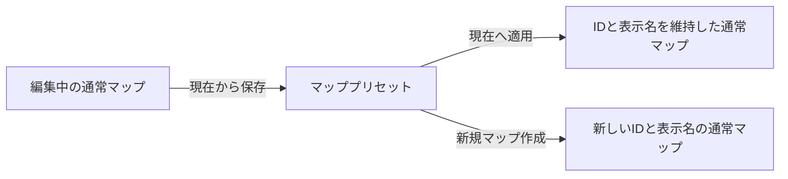

# マッププリセット機能説明書

## 目的

似た構造のマップを繰り返し作るため、通常マップを再利用可能なプリセットとして保存する。プリセット専用の変換形式は作らず、通常マップと同じJSON構造を使う。

## 保存場所と責務

| 対象 | 保存場所 | 担当 |
| --- | --- | --- |
| 通常マップ | `data/maps/<map_id>/map.json` | `GameRepository` |
| マッププリセット | `data/map_presets/<preset_id>.json` | `MapPresetStore` |
| 編集画面 | `src/kadoka_quest/apps/map_editor.py` | 入力と操作の受付 |

## 読込フロー

「現在へ適用」は現在のマップIDと表示名を維持し、幅・高さ・開始地点・地形・出現表・固定モブ・イベントなどをプリセットの内容へ置き換える。適用結果は未保存状態となり、通常の保存操作を行うまで `data/maps` へ書き込まれない。

「新規マップ」は指定した新しいマップIDと表示名へ置き換えたうえで、`data/maps/<map_id>/map.json` として保存して開く。

## 安全性

- 未保存の変更がある状態では、プリセットの適用やプリセットからの新規マップ作成を行わない。
- 同名プリセットの意図しない上書きを防ぐ。現在選択中の同一プリセットを保存した場合だけ更新として扱う。
- 新規マップ作成時は、既存ID、マップサイズ、タイル配列サイズ、未知のブロックIDを検証する。
- プリセットJSONは通常マップとして読めるため、MOD制作者が直接コピー・編集できる。
