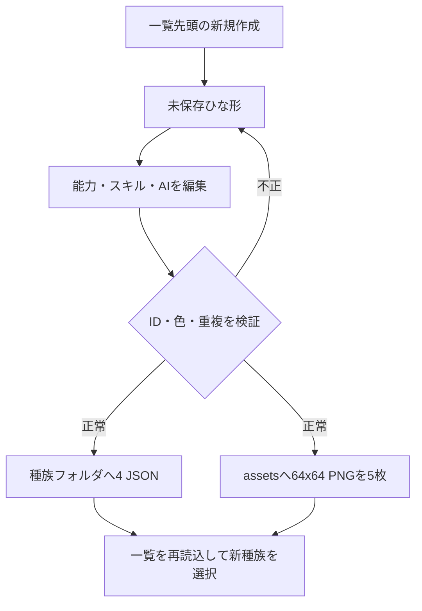

# モンスター種族新規作成機能説明書

## 目的

既存フォルダを手作業で複製せず、モンスターエディターだけでゲームが直ちに読み込める新種族を作成する。

## 操作

種族一覧の一番上にある「＋ 新規作成」を選択する。未保存のひな形が能力編集画面へ読み込まれるため、種族ID、種族名、色、レベル別能力、AI、習得スキルを編集して「保存」を押す。

| 入力 | 規則 |
|---|---|
| 種族ID | 半角英小文字、数字、`_`、`-`。既存IDは使用不可 |
| 種族名 | 空の場合は種族IDを使用 |
| 色 | `#RRGGBB` |
| 能力 | レベル1～100の6能力。新規ひな形は編集可能な初期成長値を持つ |
| スキル | 初期状態でレベル1の通常攻撃とレベル3の防御 |
| ＋選択 | ＋1～＋10にHP系と攻撃系の連続分岐を作成 |



## 生成物

```text
data/species/<species_id>/
  species.json
  stats.json
  skills.json
  plus.json

assets/characters/<species_id>/
  portrait.png
  field_front.png
  field_right.png
  field_left.png
  field_back.png
```

5画像は透明背景の64×64プレースホルダーで、追加ライブラリを必要としない。作成後は共通ドットエディターから個別に描き直せる。新規作成を確定する前に画像だけを保存することはできないため、不完全な種族フォルダは作られない。

JSON生成と検証は `data/species_creator.py`、画面操作は `apps/monster_editor.py` が担当する。
