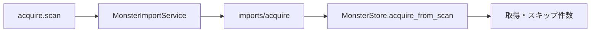
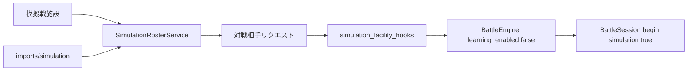
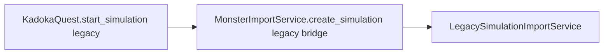

# 外部個体取込責務分離機能説明書

## 目的

外部の個体フォルダを取得する処理を `game.py` から切り離す。`MonsterImportService` は既存の個体JSONを探索し、取得結果をゲーム進行へ返す。pygameや描画には依存しない。

旧実装では `imports/simulation` を直接読んで模擬戦を開始していたが、現在のPlayerフローは専用模擬戦施設へ移行済みである。削除までの互換コードは `LegacySimulationImportService` へ隔離し、通常の取得責務と混ぜない。

## 責務

| 対象 | 責務 |
|---|---|
| `MonsterImportService` | `imports/acquire` の再走査。旧直接模擬戦APIへの一時的な互換delegateのみ保持 |
| `LegacySimulationImportService` | 旧 `imports/simulation` 直接読込と非学習戦闘生成。通常Player経路からは使用しない |
| `MonsterStore` | 個体JSONの検証・発見、未所有個体フォルダのコピー |
| `SimulationRosterService` | 模擬戦専用ロスター、外部模擬戦個体の取込、対戦リクエスト |
| `simulation_facility_hooks` | 模擬戦受付の起動・終了監視と非学習戦闘開始 |
| `BattleEngine` | 渡された味方と模擬戦個体から戦闘状態を構築 |

## 現在の取得フロー

## 現在の模擬戦フロー

`FieldCommandApplication` の旧 `simulation.start` は削除済みであり、通常Player UIから `MonsterImportService.create_simulation()` を直接呼ばない。

旧直接APIの一時互換経路は次だけに限定する。

この経路は削除対象であり、新規コードから利用しない。

## エラー時の契約

| 状態 | 結果 |
|---|---|
| 模擬戦施設で対戦相手が未選択 | 戦闘を開始せず受付終了メッセージを表示 |
| 現在パーティが空 | 模擬戦を開始しない |
| 個体・種族・戦闘データが不正 | 既存のデータ検証境界で拒否する |
| 正常 | `learning_enabled=False` の戦闘を開始する |

## 保存形式

取得は `imports/acquire/**/monster.json` と同じフォルダの `ai.json` を読み、未所有IDだけを現在セーブの `monsters/<id>/` へコピーする。

模擬戦個体は通常所有個体と分離した現在セーブの simulation rosterへ取り込み、通常牧場へ混ぜない。通常Player進行へAI学習・経験値・スカウト・消費アイテム消費を持ち込まない。
