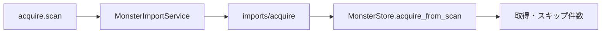
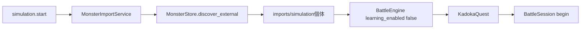

# 外部個体取込責務分離機能説明書

## 目的

外部の個体フォルダを取得または模擬戦へ使う処理を `game.py` から切り離す。`MonsterImportService` は既存の個体JSONを探索し、取得結果または模擬戦生成結果をゲーム進行へ返す。pygameや描画には依存しない。

## 責務

| 対象 | 責務 |
|---|---|
| `MonsterImportService` | 取得フォルダ再走査、模擬戦フォルダ探索、学習無効な戦闘生成 |
| `MonsterStore` | 個体JSONの検証・発見、未所有個体フォルダのコピー |
| `BattleEngine` | 渡された味方と外部個体から戦闘状態を構築 |
| `KadokaQuest` | 結果メッセージの表示、成功時の戦闘セッション開始と画面遷移 |

## フロー

## エラー時の契約

| 状態 | 結果 |
|---|---|
| 模擬戦個体が0体 | 戦闘を生成せず、配置案内を返す |
| 個体・種族・戦闘データが不正 | 例外内容を含む読込エラーを返す |
| 正常 | 学習無効の戦闘と開始案内を返す |

サービスが戦闘を返さなかった場合、ゲームは現在画面と戦闘セッションを変更しない。

## 保存形式

取得は `imports/acquire/**/monster.json` と同じフォルダの `ai.json` を読み、未所有IDだけを現在セーブの `monsters/<id>/` へコピーする。模擬戦は `imports/simulation` を直接読み、現在セーブへコピーしない。新しいJSONキーや中間形式は追加しない。
