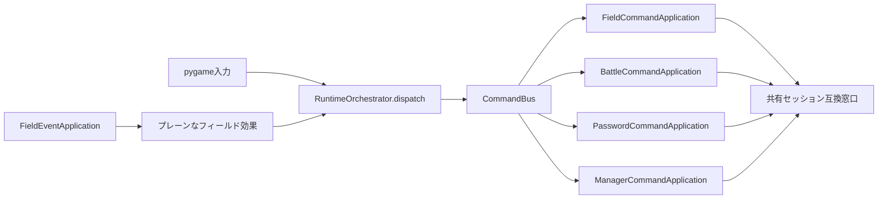

# 実行時オーケストレーター機能説明書

## 目的

画面モード、コマンドバス、アプリ登録、別アプリへの遷移を1つの状態機械へ集約する。pygame入力ループやフィールドイベント処理が、戦闘・暗号入力・管理画面のメソッドを直接呼ばない構成にする。

## 責務

| クラス | 責務 |
|---|---|
| `RuntimeOrchestrator` | 現在の画面モード、直前モード、共通バス、コマンド対象登録、フィールド効果の配送 |
| `CommandBus` | 1つのtargetを登録済みハンドラー1つへ配送 |
| `FieldEventApplication` | NPC・マップイベントをプレーンな効果へ変換 |
| 各CommandApplication | 対象アプリ内のactionを実行 |
| `KadokaQuest` | 各アプリが共有する既存セッション互換窓口 |

## 配送の流れ

## 画面モード

有効なモードは `field / battle / password` の3種類である。`RuntimeOrchestrator.transition_to()` だけが現在モードと直前モードを更新する。不明なモードは例外にし、黙ってフィールドへ戻さない。`KadokaQuest.mode` は互換用プロパティとしてこの状態を参照する。

## フィールド効果からコマンドへの変換

| 効果 | target | action |
|---|---|---|
| `transition` | `field` | `map.change` |
| `npc_despawn` | `field` | `mob.despawn` |
| `register_church` | `field` | `church.register` |
| `gain_item` | `field` | `item.gain` |
| `npc_battle` | `battle` | `start.wild` |
| `open_password` | `password` | `open` |
| `open_manager` | `manager` | `open` |

`message` と `none` は別アプリを動かさない。未知の効果は例外にして、実装漏れを発見できるようにする。

## payload契約

payloadは文字列、数値、真偽値、null、リスト、辞書だけで構成する。固定モブの辞書には表示補間用 `GridMovement` が含まれるため、その実体は渡さず `npc_id` だけを渡す。戦闘開始時の出現定義もコピーした辞書として渡す。

## 継続項目

戦闘演出、暗号入力、画像取得、管理プロセスは第6～9段階で専用クラスへ移した。第10段階では `RuntimeInputAdapter` がpygameキーイベントを、第11段階では `RuntimeMouseAdapter` がパスワードと戦闘画面のクリックを意味コマンド要求へ変換した。メインループはどちらの要求もオーケストレーターへ配送する。
