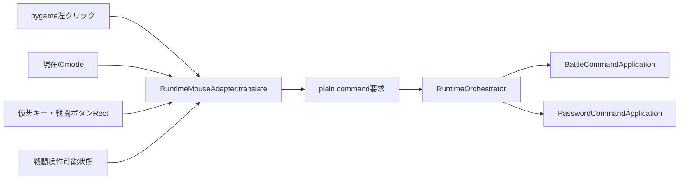

# 実行時マウスアダプター責務分離機能説明書

## 目的

パスワード画面と戦闘画面に固有のクリック当たり判定をゲーム処理から切り離す。`RuntimeMouseAdapter` はpygameの左クリックをプレーンな意味コマンド要求へ変換するだけで、コールバックやゲーム処理を実行しない。

## 責務

| 対象 | 責務 |
|---|---|
| `RuntimeMouseAdapter` | 現在の画面モード、クリック位置、登録済みRectから意味コマンド要求を生成 |
| pygameメインループ | 現在状態を渡し、生成された要求を順番に配送 |
| `Button` | 戦闘ボタンの描画、ホバー表示、使用可否の見た目 |
| `RuntimeOrchestrator` | `target / action / payload` を対象アプリへ配送 |

## 変換フロー

## 変換内容

| 画面 | クリック対象 | 意味コマンド |
|---|---|---|
| password | かなキー | `password.append` と文字 |
| password | けす | `password.backspace` |
| password | 決定 | `password.submit` |
| password | やめる | `password.cancel` |
| battle | 戦う・スカウト・道具・逃げる | `battle.execute` とコマンド名 |

左ボタン以外、登録範囲外、対象外の画面では要求を生成しない。戦闘結果が確定した後または行動ログの演出中も、戦闘ボタン要求を生成しない。

## 描画との境界

戦闘画面は従来の `Button` を描画に使い続けるが、`Button.handle` によるコールバック実行は行わない。パスワード画面も同じRect定義を描画とアダプター登録に使う。これにより表示位置とクリック範囲を一致させたまま、ゲームループから画面固有の `collidepoint` 判定を除去する。

## 保存形式

クリックから生成する要求は実行時だけのデータである。イベント、座標、RectはコマンドpayloadやJSONへ保存しないため、既存のマップ、種族、個体、セーブデータ形式に変更はない。
