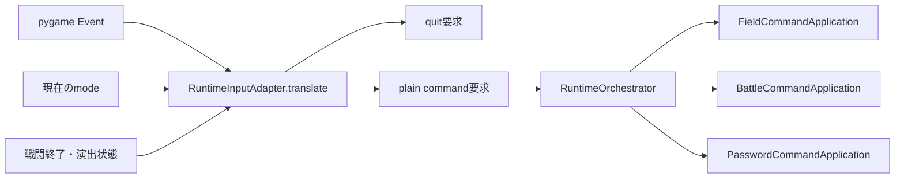

# 実行時入力アダプター責務分離機能説明書

## 目的

pygameのキーコードとイベント種別をゲーム処理から切り離し、`RuntimeInputAdapter` が画面モードに応じたプレーンな意味コマンド要求へ変換する。メインループはキーごとのゲーム動作を判断せず、変換結果を配送する。

## 責務

| 対象 | 責務 |
|---|---|
| `RuntimeInputAdapter` | pygame終了・キーダウン・キーアップ、画面モード、戦闘終了状態からコマンド要求または終了要求を生成 |
| pygameメインループ | 現在状態をアダプターへ渡し、生成された要求を順番に配送 |
| `RuntimeOrchestrator` | `target / action / payload` を対象アプリへ配送 |
| 各CommandApplication | 意味コマンドの実行 |

## 変換フロー



## 要求形式

通常操作は次のプレーン辞書を返す。

```json
{
  "kind": "command",
  "target": "field",
  "action": "move.start",
  "payload": {"direction": "right", "now": 1200}
}
```

ウィンドウ終了またはフィールド中のEscは `{"kind": "quit"}` を返す。pygameイベント、キーコード、Surface、Rectはpayloadへ含めない。

## 主なキーマッピング

| 画面 | 入力 | 意味コマンド |
|---|---|---|
| field | 矢印/WASD押下・解放 | `move.start / move.stop` |
| field | Space、L、1～4、T、R | 調査、拾得、個体選択、作戦、AIリセット |
| field | F5～F8 | 再走査、模擬戦、プリセット保存・読込 |
| battle | 矢印 | `selection.move` |
| battle | Enter/Space | `execute.selected`。結果確定後は `return` |
| battle | 1～4 | `selection.set` の直後に `execute.selected` |
| battle | A | `auto.toggle` |
| password | 文字、Backspace、Enter | `append / backspace / submit` |
| password | Esc | `cancel` |

## 長押しと順序

OSが生成する繰返しキーダウンは無視し、最初の押下だけ `move.start` を送る。継続移動の周期は従来どおり `PlayerFieldController` が管理する。キーアップは画面モードにかかわらず `move.stop` を送り、画面遷移中に方向キーを離しても保持状態が残らないようにする。

戦闘の数字キーは1イベントから選択変更、選択コマンド実行の2要求をこの順で返す。メインループも返却順に配送する。

## 保存形式と継続項目

入力要求は実行時だけのデータであり、JSON形式は変更しない。仮想キーボードのマウスヒット判定と戦闘ボタンはまだ各画面UIにあるため、次段階でマウス入力アダプターへ分離する。
