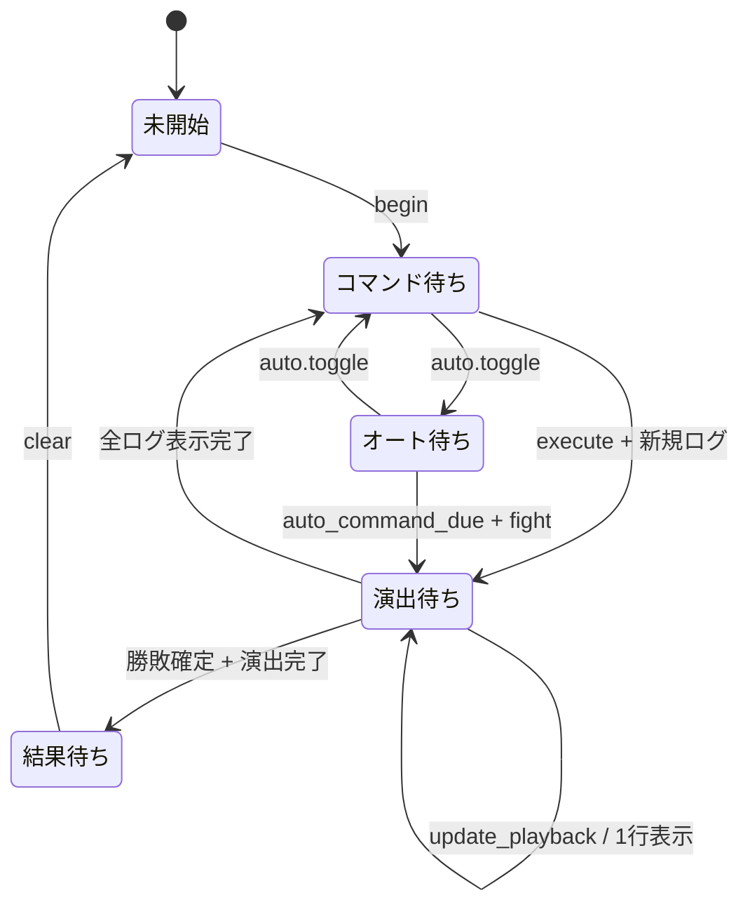

# 戦闘セッション責務分離機能説明書

## 目的

戦闘計算とは別に存在する、戦闘画面1回分の進行状態を `BattleSession` へ集約する。pygameの時計や描画へ依存せず、コマンド選択、読みやすい時間差ログ、オート戦闘、終了処理の重複防止を1つの状態機械として扱う。

## 責務

| クラス | 所有する責務 | 所有しない責務 |
|---|---|---|
| `BattleSession` | 戦闘実体の参照、コマンド選択、ログ再生位置、注目個体、オート時刻、模擬戦・固定モブ戦の識別、終了済み状態 | ダメージ計算、AI推論・学習、保存、描画、実時間の取得 |
| `BattleEngine` | ターン進行、ダメージ、勝敗、スカウト、戦闘完了通知 | 画面演出と入力状態 |
| `BattleCommandApplication` | `battle` コマンドを意味操作へ配送 | pygameイベントの解釈、戦闘状態の直接書換え |
| `KadokaQuest` | 戦闘生成、獲得・経験値・AI保存、敗北復活、固定モブ消滅の適用 | 戦闘画面固有状態の保管 |
| `BattleRenderer` | `BattleSession` の公開状態を読む描画 | ターン実行と状態更新 |

## 状態遷移

## 時刻の契約

`BattleSession` は現在時刻を取得しない。呼出側がミリ秒の整数 `now` を渡すため、pygameをimportせず単体テストできる。既定値は最初のログまで140ms、通常行動560ms、区切り・会心・勝敗など短いログ300ms、オートの次ターン待機600msである。

## 演出の契約

| 状態 | 意味 |
|---|---|
| `visible_log_count` | 描画してよいログ末尾位置 |
| `next_log_tick` | 次の1行を公開できる時刻 |
| `action_line` | 現在の行動欄へ表示する文 |
| `focus_id` | 行動中として強調する個体ID。区切り行では空 |
| `playback` | 新しいコマンドを受け付けずログを順番に公開中 |

1回の更新で公開するログは最大1行とする。これによりフレーム落ちがあっても複数行が同時に飛ばず、それぞれの行動を確認できる。

## 終了処理

`mark_finalized()` は勝敗が決まり演出が完了した最初の1回だけ `true` を返す。その後にゲーム側が戦闘完了通知、通常戦のAI保存、勝利経験値を適用する。模擬戦では従来どおり `BattleEngine.learning_enabled` が偽であるため学習と経験値を保存しない。

`clear()` は次のプレーン辞書を返してセッションを初期化する。

| キー | 用途 |
|---|---|
| `outcome` | 敗北時の教会復活、勝利・逃走後の帰還判定 |
| `simulation` | 模擬戦の敗北で教会復活させない判定 |
| `fixed_mob_id` | 勝利後に消える固定モブの特定 |

## 互換性

既存の `KadokaQuest.battle`、`battle_selection`、`auto_battle`、`battle_playback`、`battle_visible_log_count`、`battle_next_log_tick`、`battle_action_line`、`battle_focus_id`、`simulation`、`fixed_mob_battle_id` はプロパティとして残し、内部では `BattleSession` を参照する。既存描画、テスト、外部コードを一度に壊さず段階的に移行できる。
