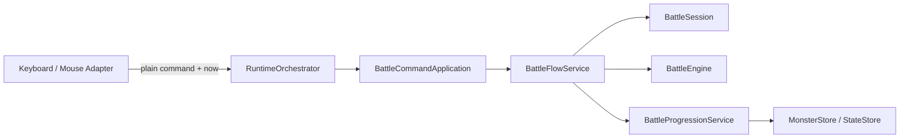
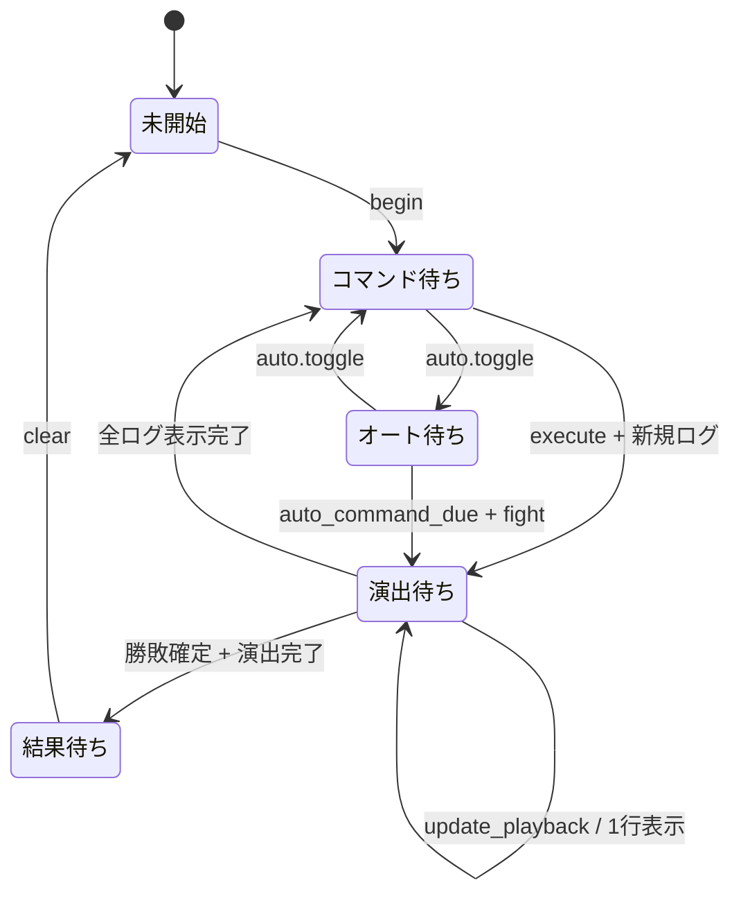

# 戦闘セッション責務分離機能説明書

## 目的

戦闘計算とは別に存在する戦闘画面1回分の状態と、戦闘コマンドに伴うアプリケーション処理を `KadokaQuest` から段階的に分離する。`KadokaQuest` は戦闘生成・画面遷移などゲーム全体の仲介へ寄せ、通常の戦闘コマンド経路は Session / Service を直接利用する。

## 責務

| クラス | 所有する責務 | 所有しない責務 |
|---|---|---|
| `BattleSession` | 戦闘実体の参照、コマンド選択、ログ再生位置、注目個体、オート時刻、模擬戦・固定モブ戦の識別、終了済み状態 | ダメージ計算、保存、描画、実時間の取得 |
| `BattleFlowService` | fight/scout/item/run の進行、ログ再生開始・更新、オート戦闘、模擬戦で禁止される操作の判定 | ダメージ計算、pygame入力、永続化の具体処理 |
| `BattleProgressionService` | スカウト獲得、消費アイテム保存、AI保存、経験値・レベルアップ | コマンド選択、描画、フィールド遷移 |
| `BattleEngine` | ターン進行、ダメージ、勝敗、スカウト判定、戦闘完了通知 | 画面演出と入力状態 |
| `BattleCommandApplication` | `battle` のplain commandを通常時は `BattleFlowService` へ配送 | pygameイベントの解釈、戦闘ルールの実装 |
| `KadokaQuest` | 戦闘生成、フィールド帰還、敗北復活、固定モブ消滅など画面間の仲介 | 通常戦闘コマンドの正規実行経路 |
| `BattleRenderer` | `BattleSession` の公開状態を読む描画 | ターン実行と状態更新 |

`BattleFlowDependencies` は上記Serviceに必要な `BattleSession / MonsterStore / StateStore / state_provider` を1つの入力コンテナとして渡す。Serviceから `KadokaQuest` 全体へ依存しない。

## 正規経路

キーボードとマウスはpygame tickを整数 `now` としてcommand payloadへ載せる。Application / Serviceはpygameをimportせず、同じ時間軸を受け取るだけとする。

## 状態遷移

## 時刻の契約

`BattleSession`、`BattleFlowService`、`BattleCommandApplication` は現在時刻を取得しない。UI Adapterがミリ秒の整数 `now` を渡すため、Application / Serviceはpygameなしで単体テストできる。

既定値は最初のログまで140ms、通常行動560ms、区切り・会心・勝敗など短いログ300ms、オートの次ターン待機600msである。

## 模擬戦

模擬戦の `scout` と消費 `item` の禁止は `BattleFlowService` の正規コマンド経路で判定する。これにより通常UI経路では `KadokaQuest.handle_battle_command` のモンキーパッチへ依存しない。

既存の `simulation_facility_hooks` に残る旧 `KadokaQuest.handle_battle_command` 用フックは、直接API利用との後方互換のための移行コードであり、互換メソッド削除時に同時撤去する。

## 終了処理

`BattleSession.mark_finalized()` は勝敗が決まり演出が完了した最初の1回だけ `true` を返す。その後のAI保存・経験値・レベルアップは `BattleProgressionService` が担当する。`BattleEngine.learning_enabled` が偽の模擬戦ではAIと経験値を保存しない。

`clear()` は `outcome / simulation / fixed_mob_id` のプレーン辞書を返し、敗北復活や固定モブ消滅などフィールド側の処理へ渡す。

## 互換性と削除候補

### 当面維持する状態property

既存描画・テスト・外部コードのため、`KadokaQuest.battle`、`battle_selection`、`auto_battle`、`battle_playback`、`battle_visible_log_count`、`battle_next_log_tick`、`battle_action_line`、`battle_focus_id`、`simulation`、`fixed_mob_battle_id` は `BattleSession` の互換viewとして当面維持する。

### 段階削除する処理delegate

`KadokaQuest.handle_battle_command`、`selected_battle_command`、`move_battle_selection`、`set_battle_selection`、`stop_auto_battle`、`toggle_auto_battle`、`update_auto_battle`、`update_battle_playback`、`finalize_battle_if_needed`、`award_experience` は旧直接呼び出し向け互換APIとする。

通常の `RuntimeOrchestrator -> BattleCommandApplication` 経路がService移行済みであることを維持し、呼出箇所とテストをSession / Serviceへ移したものから順に削除する。一度に全面削除はしない。
