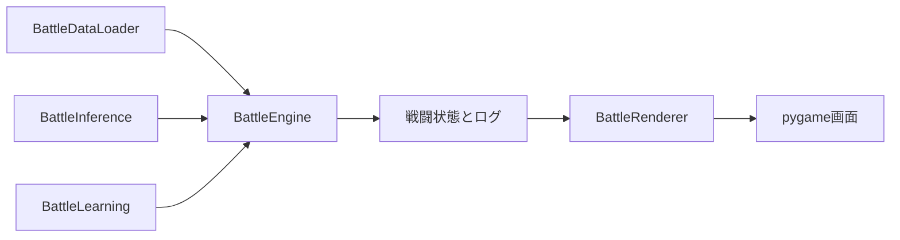

# 戦闘責務分離機能説明書

## 目的

戦闘画面、計算、学習、推論、データ読込を互いに独立した責務へ分ける。戦闘計算のテストで推論や学習を差し替えられ、画面を起動せずに各処理を検証できる構成にする。

## 責務

| 責務 | 実装 | 入出力 |
|---|---|---|
| 画面 | `BattleRenderer` | セッション状態を読んでpygameへ描画する |
| 計算 | `BattleEngine` | 戦闘参加者とコマンドからHP・MP・ログ・勝敗を更新する |
| 推論 | `BattleInference` | AI・利用可能スキル・状況タグからスキルを1つ返す |
| 学習 | `BattleLearning` | 行動報酬を個体AIの疎な重みへ反映する |
| データ読込 | `BattleDataLoader` | 種族・能力・スキル・耐性・装備から`Combatant`を作る |
| 戦闘状態 | `Combatant` | 戦闘中だけのHP・MP・強化・回避状態を保持する |

## 依存関係

`BattleRenderer`から`run_round`や学習処理は呼ばない。`BattleEngine`はリポジトリから直接種族を読まず、`BattleDataLoader`を通す。

## 学習契約

| 戦闘種別 | `learning_enabled` | `BattleLearning.learn` |
|---|---:|---|
| 通常戦 | `true` | 行動ごとに呼ぶ |
| 模擬戦 | `false` | 一度も呼ばない |

戦闘終了時のAI保存も従来どおり通常戦だけで行う。AIリセット、個体フォルダ、状況別学習のJSON形式は変更しない。

## 互換性

`core.ai.choose_skill`と`learn_from_action`は従来コード向けの窓口として残し、新クラスへ委譲する。`BattleEngine.skill_catalog`と`equipment_catalog`も読取用エイリアスとして維持する。追加のJSON形式や移行作業はない。
