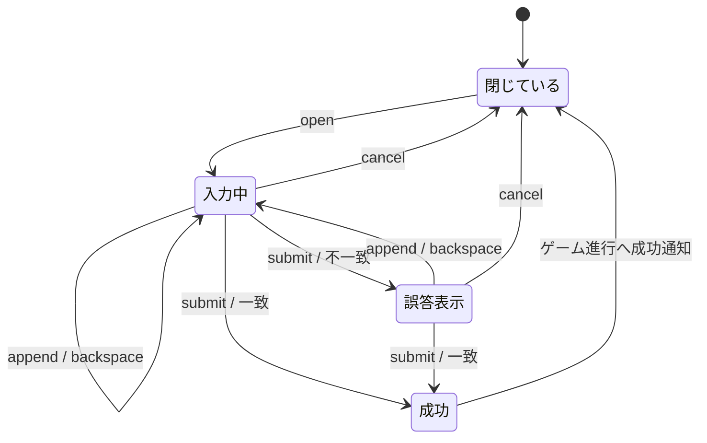

# 暗号入力セッション責務分離機能説明書

## 目的

水の湧き場で使う仮想キーボードの入力規則と一時状態を `PasswordSession` へ集約する。pygame入力、画面描画、モンスター獲得、セーブ処理と分け、文字入力規則を単体で検証できるようにする。

## 責務

| クラス | 責務 |
|---|---|
| `PasswordSession` | 許可文字、正解文字列、最大長、入力文字列、案内・誤答メッセージ、入力中状態、検証と取消 |
| `PasswordCommandApplication` | `append / backspace / submit / cancel / open` の意味コマンドを配送 |
| `KadokaQuest` | password画面への遷移、正解後のまる・かどか獲得、進行保存、フィールド帰還 |
| password描画 | セッションの入力文字列とメッセージを読む。判定は行わない |

## 状態遷移

## 入力契約

| 項目 | 内容 |
|---|---|
| 正解 | `へいわなすみか` |
| 最大長 | 正解文字列の長さから決定する7文字 |
| 許可文字 | 仮想キーボードで表示するひらがな集合 |
| 許可外文字 | 追加せず `false` を返す |
| 8文字目以降 | 追加せず `false` を返す |
| Backspace | 末尾1文字を削除し、誤答メッセージを消す |
| Cancel | 入力・メッセージ・入力中状態をすべて初期化する |

## 成功後の境界

`PasswordSession.submit()` は一致したかだけを返し、モンスターやセーブデータを知らない。成功時に `KadokaQuest` がフィールドへ戻し、未所有のまる・かどかを作成し、既存の進行フラグを保存する。既に所有している個体は重複作成しない。

## 保存形式と互換性

入力途中の文字列とメッセージは保存しないため、JSON形式の変更はない。既存の `KadokaQuest.password_input` と `password_message` は互換プロパティとして残し、描画および外部コードからは従来と同じ名前で参照できる。
