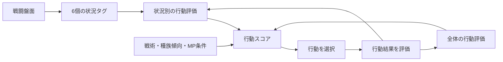

# 状況学習機能説明書

## 目的

個体AIが行動の全体的な成功経験だけでなく、戦闘時の自分・味方・敵の状況に応じて行動を選べるようにする。状態の全組合せは保存せず、固定種類の状況タグを独立して学習することで処理量と保存量を抑える。

## 状況タグ

1回の行動につき、次の各分類から1個ずつ、合計6個のタグを作る。

| 分類 | タグ | 判定内容 |
| --- | --- | --- |
| 自分のHP | `self:critical / hurt / healthy` | 自分の残HP率 |
| 味方の損耗 | `allies:critical / hurt / stable` | 最も傷ついた生存味方の不足HP率 |
| MP | `mp:low / ready` | 自分の残MP率 |
| 人数差 | `numbers:outnumbered / even / advantage` | 生存味方数と生存敵数 |
| 敵の残HP | `target:near_defeat / hurt / healthy` | 最もHP率が低い生存敵 |
| 敵との強さ関係 | `threat:stronger / even / weaker` | 自分と最高レベルの生存敵のレベル差 |

## 判断と学習



既存の `action_preferences` は状況を問わない行動評価として維持する。`context_preferences` はタグごとの行動評価を持ち、現在の6タグに対応する値だけを合算する。

状況評価は各タグ・各スキルにつき `-0.6`～`0.6`、合算後は `-1.0`～`1.0` に制限する。タグは固定種類で、実際に経験したタグと行動の組だけをJSONへ追加するため、組合せ状態を列挙する方式より軽量である。

## 保存形式

```json
{
  "action_preferences": {"attack": 0.12},
  "context_preferences": {
    "self:critical": {"defend": 0.18},
    "threat:stronger": {"evade": 0.09}
  },
  "context_actions": {
    "self:critical": 24,
    "threat:stronger": 31
  }
}
```

古い `ai.json` に新しいキーがなくても空の学習状態として扱う。AIリセットは個体の名前・レベル・＋選択・装備を維持し、全体評価と状況評価の両方を初期化する。模擬戦では従来どおり一切学習しない。
