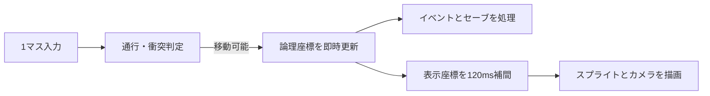

# 移動補間機能説明書

## 目的

入力・当たり判定・イベント・セーブは従来どおり整数のマス座標で処理し、フィールド上の表示だけを短時間補間する。ゲームルールを変えず、主人公と固定モブの移動およびカメラ追従を滑らかにする。

## 座標の分離

| 座標 | 型 | 用途 |
| --- | --- | --- |
| 論理座標 | 整数 | 通行判定、キャラクター重複判定、イベント、エンカウント、セーブ |
| 表示座標 | 小数 | スプライト描画、カメラ追従 |

## 補間

`GridMovement` は開始座標、目標座標、開始時刻、所要時間だけを保持する。描画時にsmoothstep曲線で現在位置を計算するため、フレームごとの座標を保存しない。

- 主人公: 120ms
- 表示される固定モブ: 180ms
- マップ切替、教会復活など歩行ではない座標変更: 補間せず即時同期

長押し中に前の補間が終わる前に次のマスへ進んだ場合は、その時点の表示座標を新しい開始地点にする。これにより連続移動でも表示位置が飛ばない。

## カメラ

カメラは整数の論理座標ではなく主人公の表示座標を中心に追従する。タイル描画も小数のカメラ位置を考慮し、画面端ではクリッピングする。マップ外は表示せず、従来のフィールド表示領域を越えて描画しない。

## 移行可能性

補間計算はpygameに依存しない `core/grid_movement.py` に置く。pygame側は計算済みの表示座標を描画へ使うだけなので、GDScriptやLuaへ移行する際にも同じ論理座標と補間規則を移植できる。
