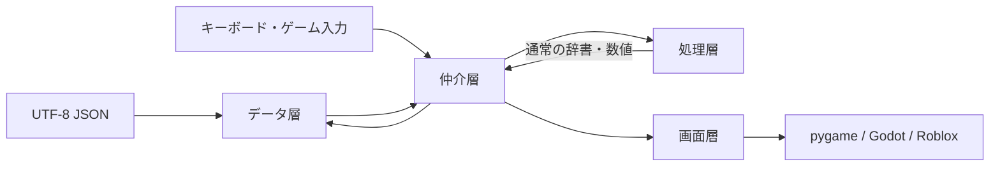

# 移植境界機能説明書

## 目的

pygame版からGodotのGDScript版またはRobloxのLua版へ移行するとき、ゲームルール・画面表示・永続データを混ぜずに段階的に置き換えられる構造を維持する。

## レイヤー境界

| レイヤー | Pythonでの主な場所 | 責務 | 移植時の扱い |
|---|---|---|---|
| データ | `data/`、`data/repository.py`、`data/*Store.py` | UTF-8 JSONの読込・保存と検証 | JSON形式は維持し、各環境のファイル／DataStore APIへ接続する |
| 処理 | `core/` | 移動、戦闘、能力値、AIなどのルール | 同じ入力と出力をGDScript／Luaで再実装する |
| 画面 | `ui/` | 描画、ウィジェット、画像の拡大縮小 | Godot Control/Node2DまたはRoblox GUIへ置き換える |
| 仲介 | `apps/` | 入力を処理層へ渡し、結果に応じて保存・画面遷移する | 各エンジンのScene/Controllerに置き換える |

pygame固有型は `ui/` と入力受付を行う `apps/` の外へ渡さない。処理層の公開入出力は数値、文字列、真偽値、リスト、辞書のみとする。

## フィールド処理の移植契約

`core/field_engine.py` の `FieldEngine` はpygameとファイルI/Oへ依存しない。マップ辞書とブロック辞書を受け取り、フィールドの空間ルールだけを判定する。

`resolve_player_move` は元の座標を変更せず、次の形式の辞書を返す。

| キー | 内容 |
|---|---|
| `kind` | `moved` または `blocked` |
| `reason` | `walkable`、`out_of_bounds`、`hidden_character`、`visible_character`、`blocking_event`、`blocked_tile` |
| `x`, `y` | 判定後の論理マス座標。失敗時は元の座標 |
| `direction` | `left`、`right`、`back`、`front` |
| 追加情報 | 必要に応じて `character`、`event`、`block_id`、`block` |

処理層は戦闘開始、メッセージ文面、セーブ、アニメーションを実行しない。`apps/game.py` が結果を解釈して、それぞれの処理へ接続する。

フィールド描画は `ui/field_renderer.py` にあり、論理マス座標と `GridMovement` の表示座標を読むだけでゲーム状態を変更しない。マップイベントは描画レイヤーを持たず、地形の色を変更しない。

## 移植手順

1. 現行JSONを新環境で読み、辞書相当の値へ変換する。
2. `FieldEngine` とほかの `core/` のテストケースを同じ入出力で移植する。
3. 新しい画面層を実装し、処理結果だけを描画する。
4. Scene/Controllerで入力、処理、保存、画面遷移を接続する。
5. Python版と同じサンプルJSONを使い、移動可否・イベント・戦闘結果の一致を確認する。

GDScriptやLuaに都合のよい画面情報をJSONへ追加しない。表示だけに必要な一時状態は画面層、ゲーム進行に必要な状態だけをセーブデータへ置く。
