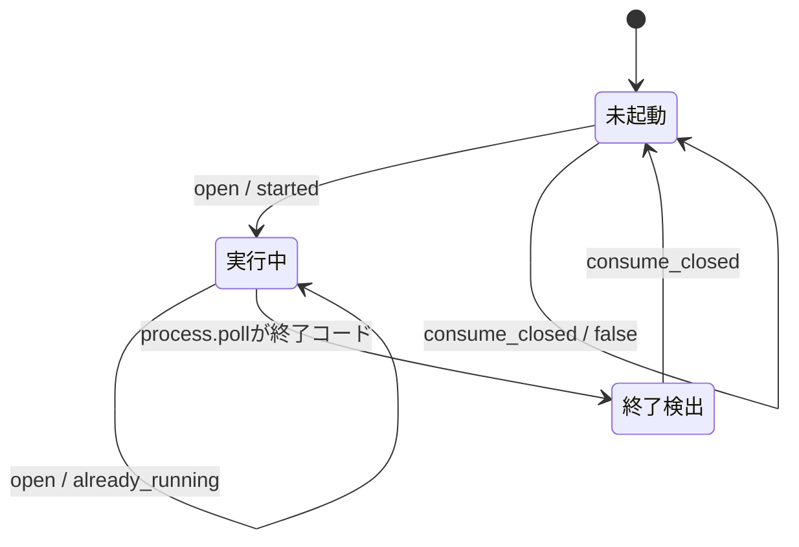

# 管理ツールプロセス責務分離機能説明書

## 目的

牧場から開く個体・パーティ管理ツールについて、外部プロセスの生成、二重起動防止、終了検知を `ManagerProcessService` へ集約する。ゲーム進行はプロセスAPIを直接扱わず、意味のある結果だけを受け取る。

## 責務

| 対象 | 責務 |
|---|---|
| `ManagerProcessService` | Python実行ファイル、管理スクリプト、作業フォルダ、プロセスハンドル、起動、実行中判定、終了通知の消費 |
| `ManagerCommandApplication` | `manager.open / manager.refresh` コマンドの配送 |
| `KadokaQuest` | 起動結果のメッセージ表示、終了通知後のアクティブセーブ再読込 |
| `manage.py` | 個体管理とパーティ編集の独立GUI |

## 起動と終了の流れ

## 起動契約

| 項目 | 内容 |
|---|---|
| コマンド | `[現在のPython, manage.pyの絶対パス]` |
| 作業フォルダ | `manage.py` の親であるプロジェクトルート |
| 実行中の再起動 | 新しいプロセスを作らず `already_running` を返す |
| 未起動・終了済み | 新しいプロセスを作り `started` を返す |

実行ファイルと起動関数はコンストラクターから差し替え可能であり、実際のGUIを開かずに単体テストできる。

## 終了通知

`consume_closed()` はプロセスが終了した最初の呼出しだけ `true` を返し、内部ハンドルを空にする。ゲーム側はこの時だけ `StateStore.load()` を呼び、管理画面で変更された個体・AI・パーティを反映する。次フレーム以降は `false` となるため、毎フレームセーブを読み直さない。

## 保存形式と互換性

プロセスIDや終了コードは保存しない。既存の `savedata/<name>/` 形式に変更はない。`KadokaQuest.manager_process` は既存コード向けの互換プロパティとしてサービス内部のハンドルを参照する。
